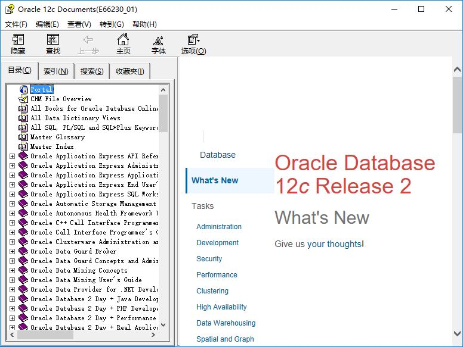
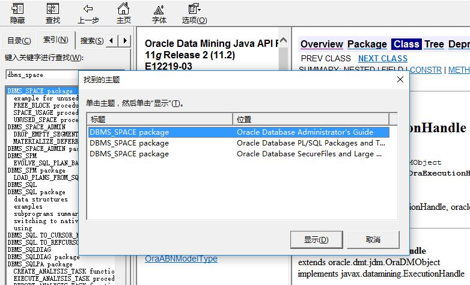
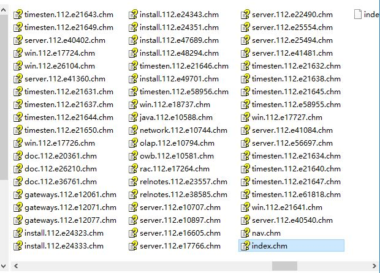

# Oracle-DB-Document-CHM-builder
Generate Oracle database online documents into offline CHM file set. For self use and is user-unfriendly. 
 Features:
* One book per CHM file, can be used separately, refer to `index.chm->CHM File Overview`
* `index.chm` to combine the contents and indexes of all books
* Supports cross-book searching
* Portable and no depedency in all Windows platforms

# Available Prebuild CHM books:
Refer to https://pan.baidu.com/s/1hrTfE9e

# Screen-shots
 
 
 

# Dependencies
All dependent libraries have been included in this project:
* LuaJIT        : https://github.com/LuaJIT/LuaJIT
* lua-htmlparser: https://github.com/msva/lua-htmlparser
* Json4Lua      : https://github.com/craigmj/json4lua

# Build Steps For Further Reference
* Download Oracle db offline document(http://docs.oracle.com/en/database/) in HTML format and extract as the source
* Install Microsoft HTML Help Workshop(https://msdn.microsoft.com/en-us/library/ms669985.aspx)
* Copy files from source into a new destination, excluding pdf/mobi/epub files
* Build content file (.hhc) based on `target.json`
* Build index file (.hhk) based on `index.htm`
* Build project file (.hhp) which includes all needed files
* Rewrite all HTML files to adjust some elements for offline purpose
* change some css files to adjust the HTML layouts
* Build .bat files for compile purpose
* Launch .bat files to compile all documents
* Create index.chm 
